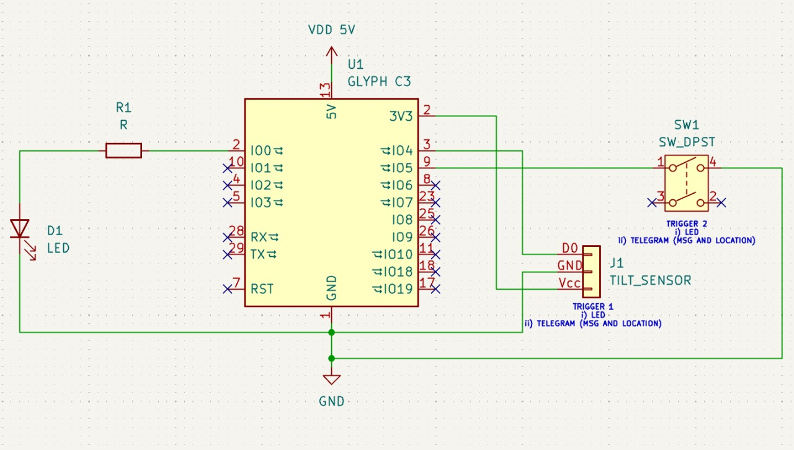

# 🛡️ SILENT GUARDIAN

**SILENT GUARDIAN** is a smart safety device built using **ESP32-C3** and **Arduino**, designed to send alerts via **Telegram Bot** with location tracking.  
It is developed as part of my IoT + Embedded Systems learning project.  

---

## 🚀 Features
- 📡 Sends **Telegram alerts** with text + location.  
- 🔘 Panic button and tilt sensor for emergency detection.  
- 💡 LED status indicator.  
- 📂 Includes project documentation and report.  

---

## 🛠️ Tech Stack
**Hardware:** ESP32-C3 (Glyph C3), Tilt Sensor, Push Button, LED  
**Software:** Arduino IDE, Telegram Bot API, GitHub  

---
## 📖 Project Report
You can read the full report here:  
👉 [Download PDF](docs/SILENT_GUARDIAN.pdf)

---

## 🖼️ Images

### Circuit Diagram

### Silent Guardian Diagram

---

## ▶️ How to Run

1. Clone this repo:
   
   git clone https://github.com/<A-MOULIESWARAN>/SILENT_GUARDIAN.git
   cd SILENT_GUARDIAN/code
